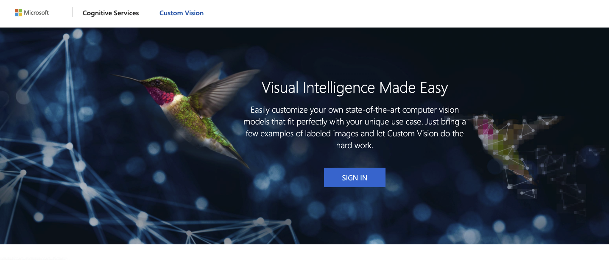
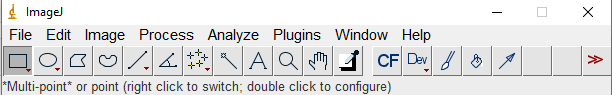
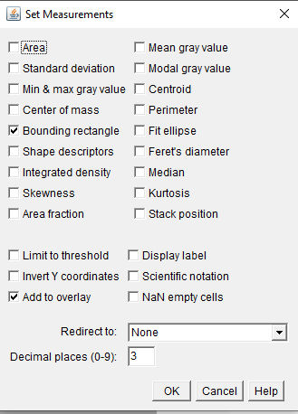
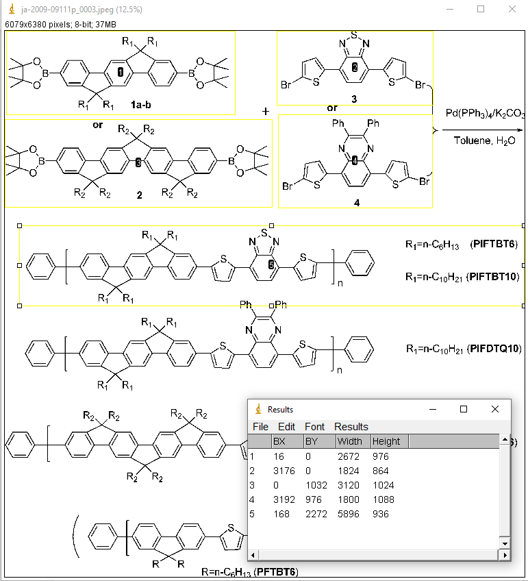

# Azure Custom Vision for Materials Science


# Tutorial Part 1 
## Using Azure Custom Vision to do image classification 


# Tutorial Part 2 
## Using Azure Custom Vision to do image object detection 
### 2.1 Using imageJ to label image for Object Detection 
#### Install ImageJ 

To install ImageJ, check this website [https://imagej.nih.gov/ij/download.html](https://imagej.nih.gov/ij/download.html)
```markdown
If you are mac user, you might need to enable installation of applications from unidentified developers by Mac. To do that, see this website https://support.apple.com/guide/mac-help/open-a-mac-app-from-an-unidentified-developer-mh40616/mac
```
 The user interface of ImageJ looks like this:


Before labeling, go to ```Analyze``` $->$ ```Set Measurement```. In the popped window, choose ```Bounding rectangle``` and ```Add to overlay```. and then click ```ok```



#### Download the dataset

Creat a folder on your local drive for this example name (YourNetID_ObjectDetection). Please download molecules' image data set from here: https://github.com/lunayuehuang/Mse544-CustomVision/tree/main/molecules to YourNetID_ObjectDetection/molecures 

Then, use ```File``` $->$ ```Open``` to open one image, and use ```Rectangle``` (the most left one botton) selection tool to select an area with just one molecule, then press M on your keyboard. It should pop out a ```Results``` window that contains the boxes information. Once all the molecule are labeled, save the measurement as a text file (ending with .txt) in an other folder YourNetID_ObjectDetection/ImagePractice. Each image should have one text file with a correspondent name (same name different file type). Repeat the process and generate a txt files for at least 3 images as practice. 

To save time for this tutorial, we have labeled all images. To continue this tuorial, please download the lable images to the same folder of your molecules image folder (not the ImagePractice Folder)  https://github.com/lunayuehuang/Mse544-CustomVision/tree/main/labels



### 2.2 Upload labeled data for training 
 


 