# Azure Custom Vision for Materials Science

Before getting started, git clone or download this repository (https://github.com/lunayuehuang/Mse544-CustomVision.git) to have all the test data on your local machine.


# Tutorial Part 1
## Using Azure Custom Vision to do Image Classification 

### 1.1 Create resources on Azure Custom Vision.

Go to the Azure Custom Vision portal: [https://www.customvision.ai/](https://www.customvision.ai/) and sign in with your uw-email (it will automatically re-direct you to the UWID authentication page). The main page of the Azure Custom Vision looks like this:


Click the gear-like setting button, and then in the following page click ```create new``` to create a resource to host projects.  


In the follwoing prompts, fill out the entries for creating the resources as:

the name of the resoure is recommanded as ```cv_<your_UWNetID>```.

Once the resource is created, you can find out the ```Key```, ```Endpoint``` and ```Resource Id``` as following, which will be useful when you incorporate projects using python scripts.
 


### 1.2 Create a image classification project using Azure Custom Vision web interface

Use the the eye-like botton on the upper right cornor to navigate back to the project gallery page (the main page). Then click ```New Project``` to create a project. 


Once a project is created, go into the project page, it will looks like this:

The most important takeaway information is that the buttons on top bar navigates you to different stages of a project. 


### 1.3 Upload images with tags and train model

In this tutorial, we will be using a very small subset, with 10 clear and 10 crystals images, from MARCO to train a model. All the images are stored in ```marco_subset``` folder in this repository. Go the project page, select ```Training Images``` from the top bar, and then ```Add images```. 


Then firstly, select all images (using ```shift``` on your keyboard) from ```macro_subset/crystatls_train``` to upload them. 


In the following prompt, type ```crystals``` in the field of ```My Tags```, and then click upload.


Repeat the same step for images in ```macro_subset/clear_train``` with another tag ```clear```.

Once you finish uploading and taging the images, you will find out on the left side bar, there is a summary of pictures uploaded.


Now the model is ready for training, click the ```Train``` button on top bar and use ```Quick Training``` to train the model.


When Training is finished (it will takes less than 5 minutes), you will obtain a page summarizing the training results and metrics.


### 1.4 Quick test on the prediction of the model

Once you have a model, you can do ```Quick Test``` with images in ```macro_subset/clear_test``` and ```macro_subset/crystals_test``` to see how is this simple model performs.

For example, click ```Quick Test```,  


Then in the propmted window, choose ```Browse local files```, and select one of the image from test folders.


It will automatically run the image classification on the selected image, and output results look like this:


# Tutorial Part 2 
## Using Azure Custom Vision to do image object detection 

### 2.1 Create a object detection project using Azure Custom Vision web interface 

Similar as step 1.2, we will create a object detection project instead, and the entries of prompted window are filled as:
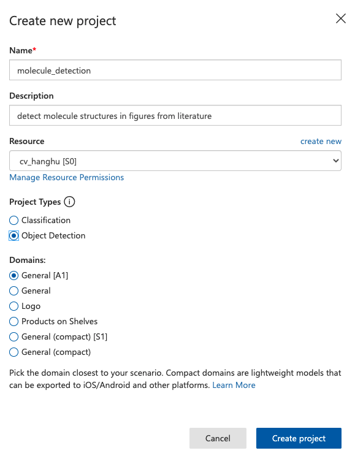


### 2.2 Using ImageJ to label images for Object Detection 
#### Install ImageJ 

To install ImageJ, check this website [https://imagej.nih.gov/ij/download.html](https://imagej.nih.gov/ij/download.html)
```markdown
If you are mac user, you might need to enable installation of applications from unidentified developers by Mac. To do that, see this website https://support.apple.com/guide/mac-help/open-a-mac-app-from-an-unidentified-developer-mh40616/mac
```
 The user interface of ImageJ looks like this:
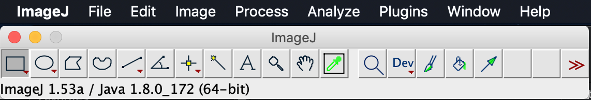

#### Change measurement settings
Before labeling, go to ```Analyze``` > ```Set Measurement```: 
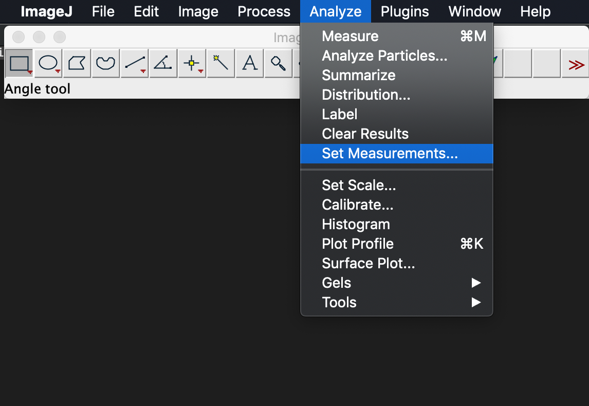

In the prompted window, choose ```Bounding rectangle``` and ```Add to overlay```, then click ```ok```
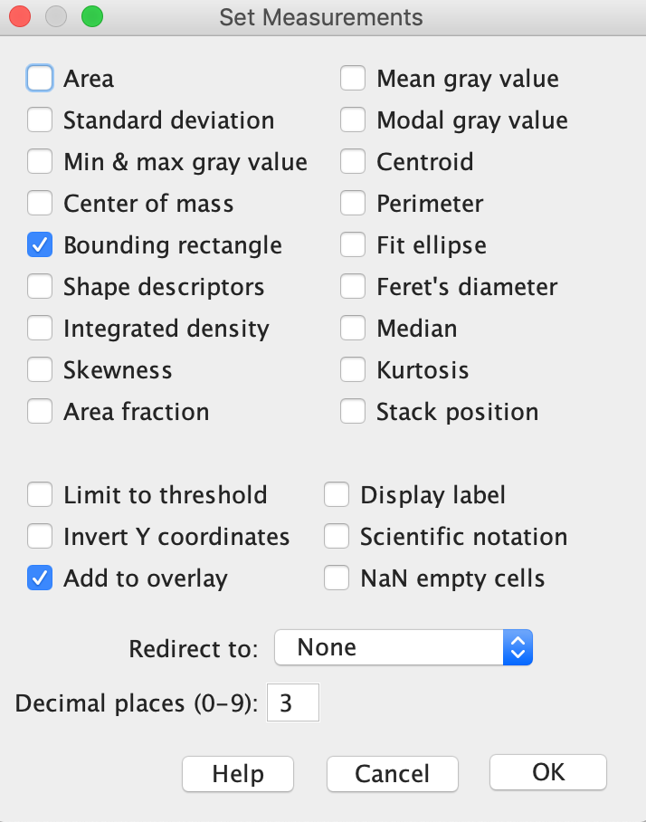

#### Label molecules in images

For each of the images, the labeling work flow is generally:

- i. Open images using ```File``` > ```Open```, and locate a image in the folder ```molecules```
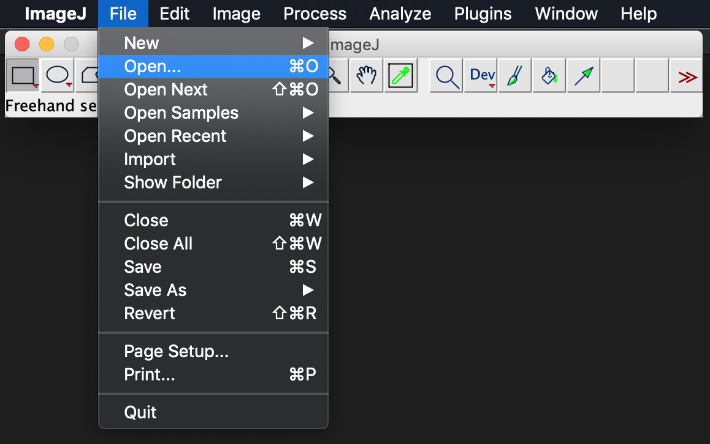


- ii. Use ```Rectangle``` selection tool and select on image with only one molecule, and then press M on your keyboard. A ```Results``` window will be prompted out with all the rectangle coordinates. Repeat this step until all the molecules in the image are labeled.
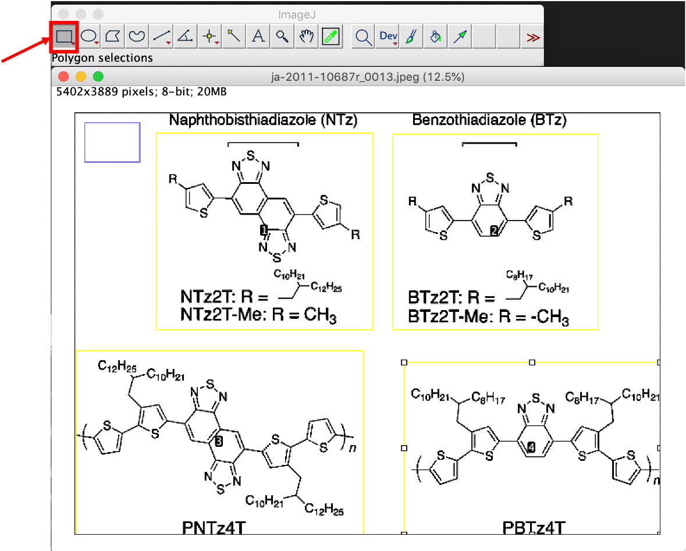
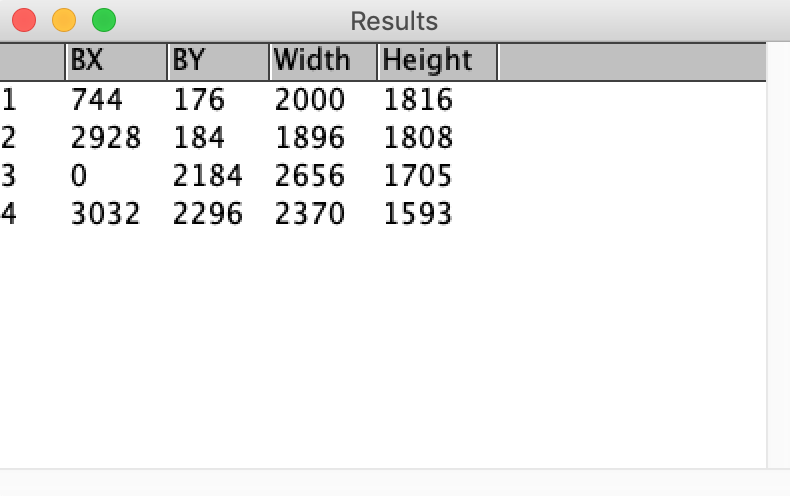

- iii. Select the ```Results``` window and right click, choose the ```Save``` to save labels as a text file. Normally file name will be same as the image but with an extention as  ```.txt```.
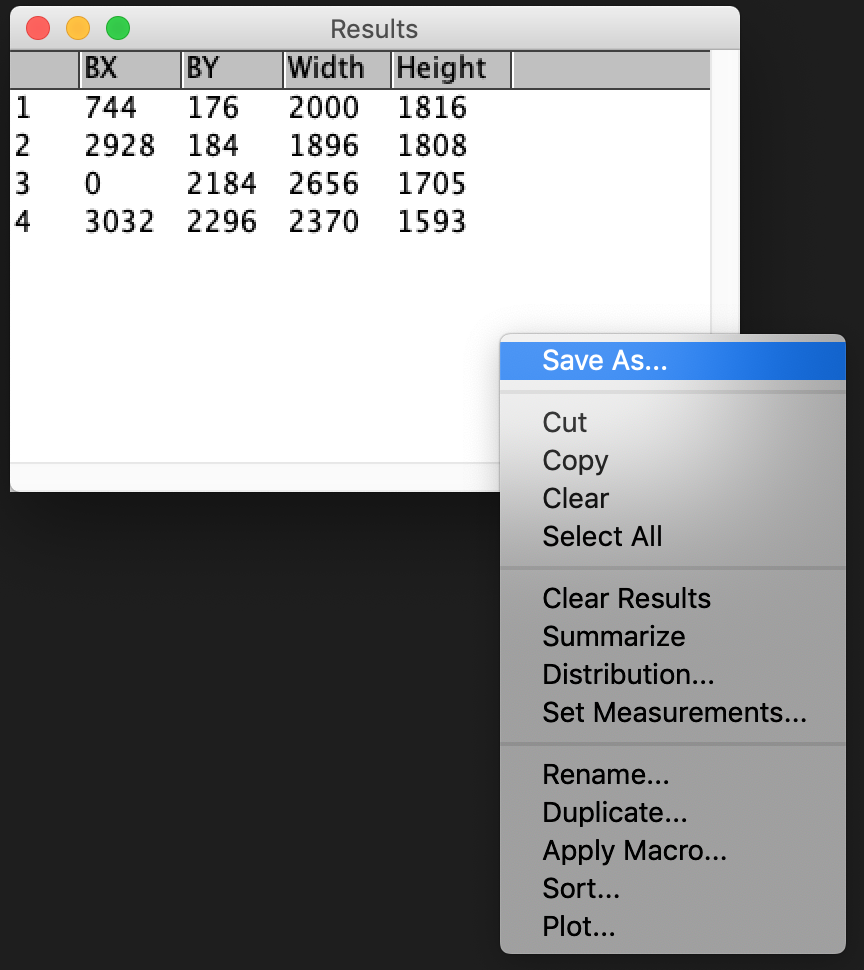
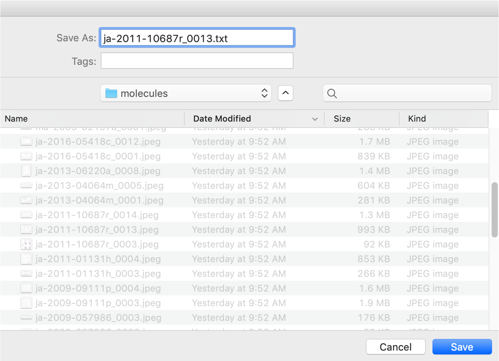

To save time for this tutorial, we have labeled all images under ```molecules/labels```. However, to ensure you familiar with this work flow, choose at least 3 images for practice this workflow. 

### 2.3 Upload images with labels for training

#### Pre-requests

Install the required libraries using pip:
- Azure Custom Vision client Library
- sklearn 
- scikit-image 
```
pip install azure-cognitiveservices-vision-customvision sklean scikitimage
```

#### Helper Classes and Functions

In order to simplify the process of using python scripts to build object detection projects on Azure Custom Vision, two helper classes are built:

- ```labeledImage```: a data structure class used for collecting the information and labels of an image.

- ```AzureCVObjectDetectionAPI```: an API class that simplifies the process of creating project, uploading images and performing batch prediction for object detection on Azure Custom Vision  

and a function is included:
- ```read_measurements```: a helper function to read all the rectangular boxes

The detailed documentation are located in the file ```util.py```

#### Create Python scripts for image uploading
1. Create a jupyter notebook at the same folder of this tutorial, change the name as ```image_upload.ipynb```.

2. import all necessary packages and helper function/class.
    ```
    import os
    from util import labeledImage, read_measurements, AzureCVObjectDetectionAPI
    from sklearn.model_selection import train_test_split
    ```

3. Using the helper class ```labeledImage``` to store all the image labels.
    ```
    molecules_dir = './molecules/'
    labels_dir = './molecules/labels/'

    labeled_images = []
    tag = 'molecule'

    for file in os.listdir(molecules_dir):
        if file.endswith(".jpeg"):
            image_path = os.path.join(molecules_dir, file)
            label_path = os.path.join(labels_dir, file.split('.')[0] + '.txt')
            labeled_images.append(labeledImage(image_path))
            labeled_images[-1].add_labels(tag, read_measurements(label_path))
    ```
    you can check one of the ```labledImage``` by just calling ```print``` function:
    ```
    print(labeled_images[0])
    ```
    the output should looks like:
    ```
    Labeled image ma-2010-01523a_0003.jpeg
    location: ./molecules/ma-2010-01523a_0003.jpeg
    shape: (1247, 4000)
    lables:
    - molecule: 
      [0, 6, 708, 1059]
      [768, 426, 1098, 555]
      [2793, 0, 1207, 1247]

    ```

4. Split the image into training and test with the ratio of 4:1
    ```
    train_images, test_images = train_test_split(labeled_images, test_size=0.2, random_state=42)
    ```

5. Find and fill in all the ids and credentials for your project. And then make a ```AzureCVObejectDetectionAPI``` object.
   ```
    Endpoint    = '<Your_End>'
    Key         = '<Your_KEY>'
    Resource_Id = '<Your_Resource_Id>'
    Project_Id  = '<Your_Project_Id>'

    ACVObjectDetector = AzureCVObjectDetectionAPI(Endpoint, Key, Resource_Id, Project_Id)
   ```
   All those entries can be found in your obeject detection projecct at the Azure Custom Vision web interface:
   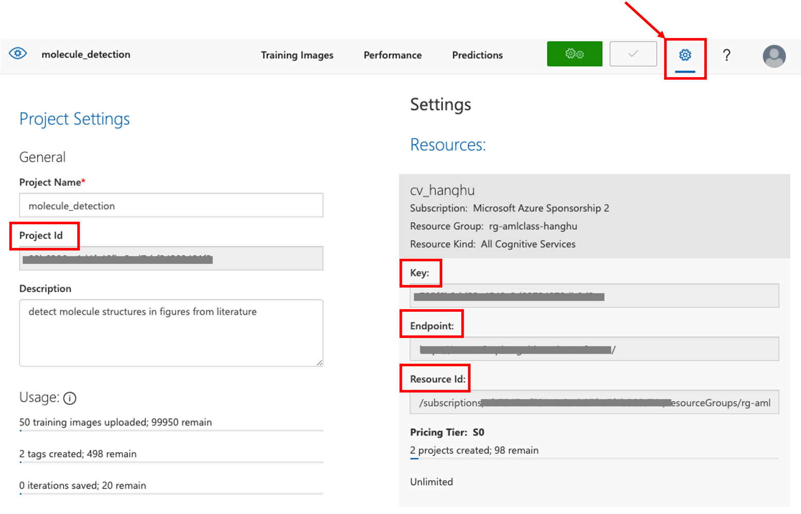

6. Upload the images.
    ```
    ACVObjectDetector.upload_training_images(train_images)
    ```

7. print out the ```test_images``` and latter will use them for quick test.
    ```
    for image in test_images: print(image.name)
    ```

### 2.4 Train the model

Go back to your project on Azure Custom Vision Web interface, and click ```Training```. 
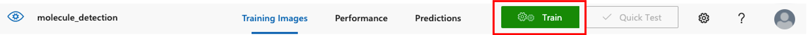

In the prompted window, we are still using the ```Quick Training``` option. 


When Training is finished (it will takes about 10 to 15 minutes.), you will obtain a page summarizing the training results and metrics.


### 2.5 Quick test on the prediction of the model
Once you have a model, you can do ```Quick Test``` with ```test_images``` from the output of 2.3 step 7. 

For example, click ```Quick Test```,  
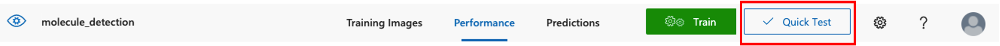

Then in the propmted window, choose ```Browse local files```, and select one of the image from test folders.
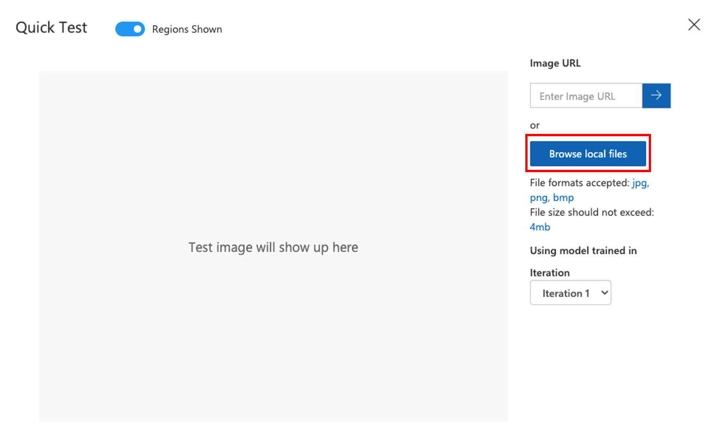

It will automatically run the object detection on the selected image, and output results look like this:
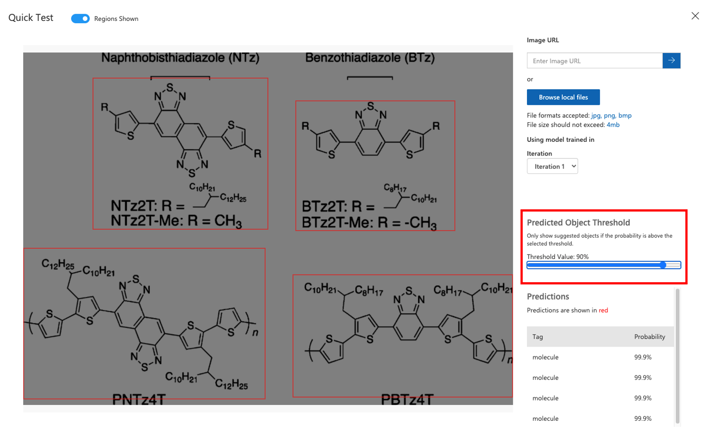
You can change the ```Predicted Object Threshold```, and for this simple project, choosing ```90%``` as the threshold value gives pretty good results.


 