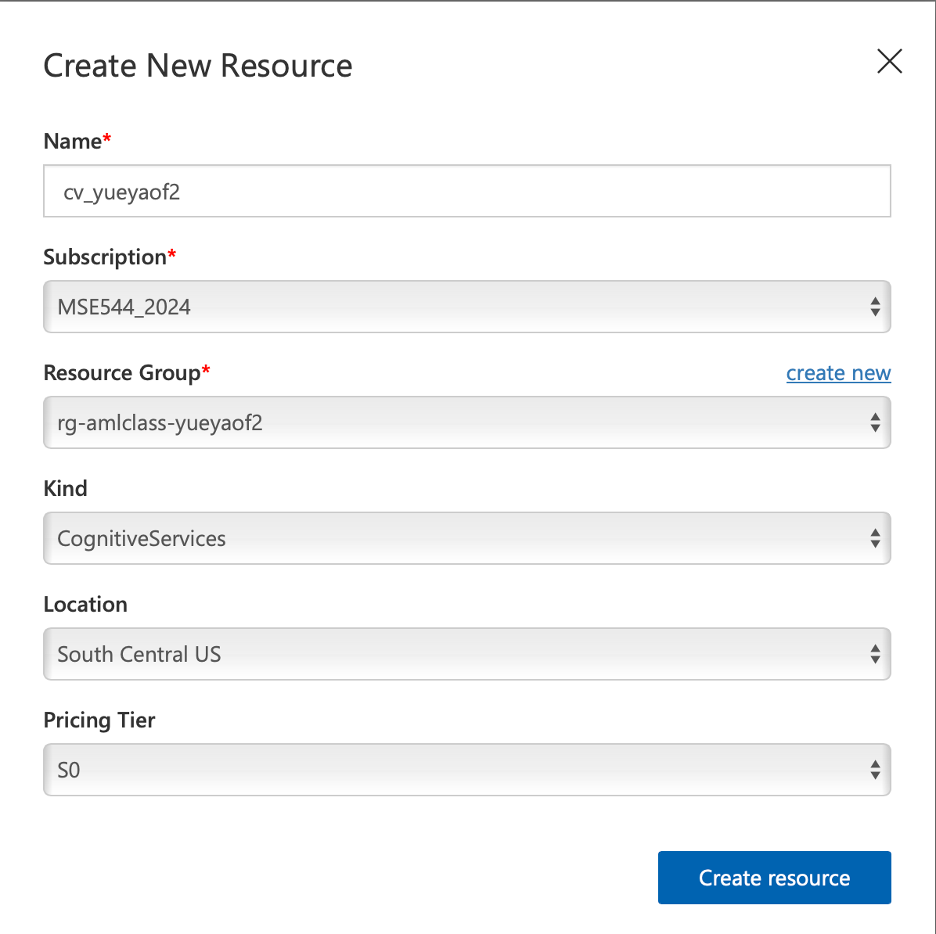
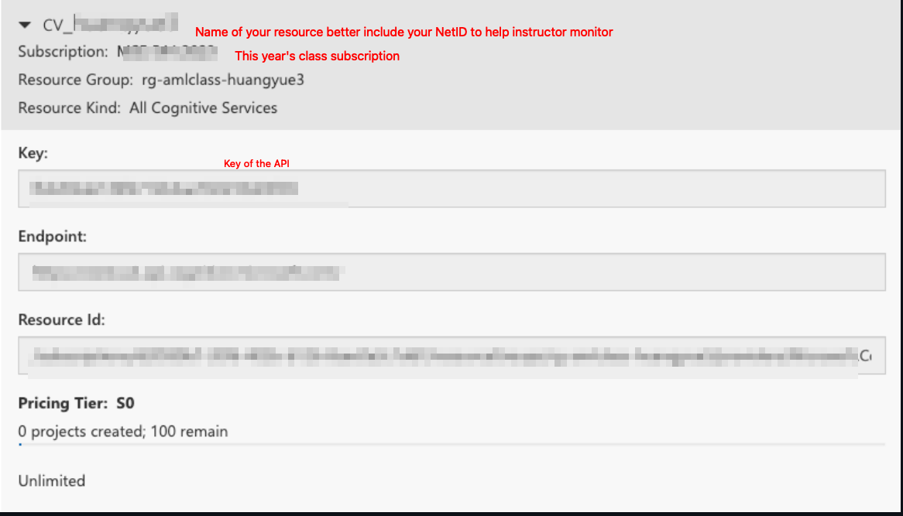

# Azure Custom Vision for Materials Science


# Tutorial Part 1
## Using Azure Custom Vision to do Image Classification 

### 1.1 Create resources on Azure Custom Vision.

Go to the Azure Custom Vision portal: [https://www.customvision.ai/](https://www.customvision.ai/) and sign in with your uw-email (it will automatically re-direct you to the UWID authentication page). The main page of the Azure Custom Vision looks like this:


Click the gear-like setting button, and then in the following page click ```create new``` to create a resource to host projects.  


In the follwoing prompts, fill out the entries for creating the resources as:

the name of the resoure is recommanded as ```cv_<your_UWNetID>```.

Once the resource is created, you can find out the ```Key```, ```Endpoint``` and ```Resource Id``` as following, which will be useful when you incorporate projects using python scripts.
 


### 1.2 Create a image classification project using Azure Custom Vision web interface

Use the the eye-like botton on the upper right cornor to navigate back to the project gallery page (the main page). Then click ```New Project``` to create a project. 


Once a project is created, go into the project page, it will looks like this:

The most important takeaway information is that the buttons on top bar navigates you to different stages of a project. 


### 1.3 Upload images with tags and train model

In this tutorial, we will be using a very small subset, with 10 clear and 10 crystals images, from MARCO to train a model. All the images are stored in ```marco_subset``` folder in this repository. Go the project page, select ```Training Images``` from the top bar, and then ```Add images```. 


Then firstly, select all images (using ```shift``` on your keyboard) from ```macro_subset/crystatls_train``` to upload them. 


In the following prompt, type ```crystals``` in the field of ```My Tags```, and then click upload.


Repeat the same step for images in ```macro_subset/clear_train``` with another tag ```clear```.

Once you finish uploading and taging the images, you will find out on the left side bar, there is a summary of pictures uploaded.


Now the model is ready for training, click the ```Train``` button on top bar and use ```Quick Training``` to train the model.


When Training is finished (it will takes less than 5 minutes), you will obtain a page summarizing the training results and metrics.


### 1.4 Quick test on the prediction of the model

Once you have a model, you can do ```Quick Test``` with images in ```macro_subset/clear_test``` and ```macro_subset/crystals_test``` to see how is this simple model performs.

For example, click ```Quick Test```,  


Then in the propmted window, choose ```Browse local files```, and select one of the image from test folders.


It will automatically run the image classification on the selected image, and output results as this:


# Tutorial Part 2 
## Using Azure Custom Vision to do image object detection 
### 2.1 Using imageJ to label image for Object Detection 
#### Install ImageJ 

To install ImageJ, check this website [https://imagej.nih.gov/ij/download.html](https://imagej.nih.gov/ij/download.html)
```markdown
If you are mac user, you might need to enable installation of applications from unidentified developers by Mac. To do that, see this website https://support.apple.com/guide/mac-help/open-a-mac-app-from-an-unidentified-developer-mh40616/mac
```
 The user interface of ImageJ looks like this:


Before labeling, go to ```Analyze``` $->$ ```Set Measurement```. In the popped window, choose ```Bounding rectangle``` and ```Add to overlay```. and then click ```ok```


#### Download the dataset

Creat a folder on your local drive for this example name (YourNetID_ObjectDetection). Please download molecules' image data set from here: https://github.com/lunayuehuang/Mse544-CustomVision/tree/main/molecules to YourNetID_ObjectDetection/molecures 

Then, use ```File``` $->$ ```Open``` to open one image, and use ```Rectangle``` (the most left one botton) selection tool to select an area with just one molecule, then press M on your keyboard. It should pop out a ```Results``` window that contains the boxes information. Once all the molecule are labeled, save the measurement as a text file (ending with .txt) in an other folder YourNetID_ObjectDetection/ImagePractice. Each image should have one text file with a correspondent name (same name different file type). Repeat the process and generate a txt files for at least 3 images as practice. 

To save time for this tutorial, we have labeled all images. To continue this tuorial, please download the lable images to the same folder of your molecules image folder (not the ImagePractice Folder)  https://github.com/lunayuehuang/Mse544-CustomVision/tree/main/labels


### 2.2 Upload labeled data for training 


 